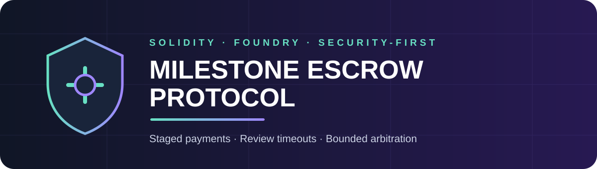
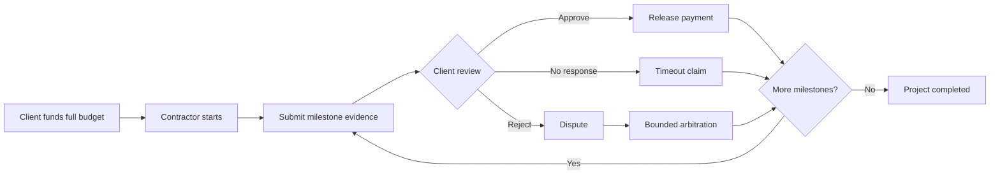

<p align="center"></p>

<p align="center">
  <a href="../../actions"></a>
  
  
  
</p>

A security-first smart-contract protocol for funding project work through sequential milestones. Clients lock an ERC-20 budget, contractors submit hashed evidence, and funds are released through approval, review timeout or bounded third-party arbitration.

> Educational and portfolio software. Not audited or ready for production custody.

## Why this exists

Traditional project escrow introduces operational trust, opaque decisions and slow settlement. A naive smart contract can be worse: unrestricted administrators, replayable milestones, stuck funds and unsafe token transfers. This protocol makes the workflow explicit and limits every role to the minimum authority required.

## Workflow



## Contract capabilities

- Permissionless factory and participant indexing
- Fully funded ERC-20 escrow
- Sequential, one-time milestone settlement
- Content-addressed evidence hashes
- Client approve/reject review flow
- Contractor claim after review timeout
- Dispute window and percentage-based arbitration
- Partial contractor/client awards
- Fee cap fixed at deployment
- Emergency pause controlled by arbitrator
- Cancellation and full refund before work begins
- Complete event surface for a web dashboard or indexer

## Role permissions

| Action | Client | Contractor | Arbitrator |
|---|:---:|:---:|:---:|
| Fund full budget | ✓ | | |
| Start project | | ✓ | |
| Submit evidence | | ✓ | |
| Approve or reject | ✓ | | |
| Claim after timeout | | ✓ | |
| Open dispute | | ✓ | |
| Resolve dispute | | | ✓ |
| Pause / unpause | | | ✓ |
| Cancel before start | ✓ | | |

## Security properties

- No proxy, owner backdoor or arbitrary withdrawal function
- Reentrancy protection on all fund-moving functions
- State updates before token transfers
- Safe handling of standard and no-return ERC-20 implementations
- Maximum 5% protocol fee
- Late rejection blocked after the review deadline
- Milestone ordering and single-settlement enforcement
- Conservation-of-funds invariant

Read the complete [security model](docs/SECURITY.md) and [architecture](docs/ARCHITECTURE.md).

## Test strategy

| Layer | Coverage |
|---|---|
| Unit | Roles, states, approvals, timeout, cancellation, pause and factory registry |
| Fuzz | Arbitrary milestone size, fee and arbitration split |
| Invariant | Budget conservation and bounded milestone index |
| Static analysis | Slither on every push and pull request |

```bash
forge test -vvv
forge test --match-path 'test/Fuzz.t.sol'
forge test --match-path 'test/invariant/*.t.sol'
slither . --foundry-out-directory out
```

## Quick start

Install [Foundry](https://book.getfoundry.sh/getting-started/installation), then:

```bash
git clone https://github.com/nikorokni/milestone-escrow-smart-contracts.git
cd milestone-escrow-smart-contracts
forge build
forge test -vvv
```

## Deploy the factory

```bash
forge script script/Deploy.s.sol:Deploy \
  --rpc-url "$RPC_URL" \
  --private-key "$PRIVATE_KEY" \
  --broadcast
```

Never commit private keys or production credentials.

## Repository structure

```text
src/                    Core contracts, interfaces and libraries
script/                 Factory deployment script
test/                   Unit and fuzz tests
test/invariant/         Stateful invariant suite
docs/                   Architecture and security model
.github/workflows/      Foundry and Slither CI
```

## Integration with DeliveryPulse

The emitted events can power an on-chain project-delivery view in [DeliveryPulse](https://github.com/nikorokni/deliverypulse-ai-project-intelligence): funded budget, milestone state, dispute exposure, released value and remaining escrow.

## Author

Built by **Niko Rokni** as a Solidity security and product-engineering portfolio project.

## License

MIT. See [LICENSE](LICENSE).

