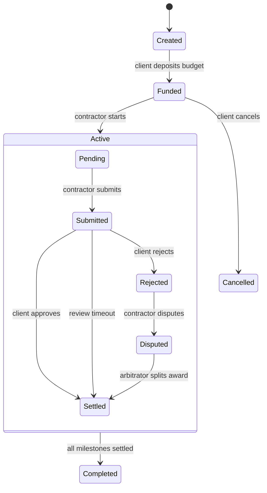

# Architecture

## Components

### EscrowFactory

- Deploys immutable escrow agreements permissionlessly.
- Indexes escrows by client, contractor and arbitrator.
- Holds no user funds and has no administrative withdrawal function.

### MilestoneEscrow

- Holds one project's ERC-20 budget.
- Enforces sequential milestone execution.
- Records evidence commitments as `bytes32` hashes.
- Supports explicit approval, time-based contractor claims and bounded arbitration.
- Applies the protocol fee only to the contractor award.

### Off-chain application

Documents and deliverables should remain in content-addressed storage. The contract stores only their hash, making on-chain evidence tamper-evident without placing sensitive project material on a public blockchain.

## State transitions



## Accounting invariant

At every reachable state:

```text
token balance held by escrow + total released + total refunded = total budget
```

The invariant suite continuously exercises submit and approve flows and asserts this property.

